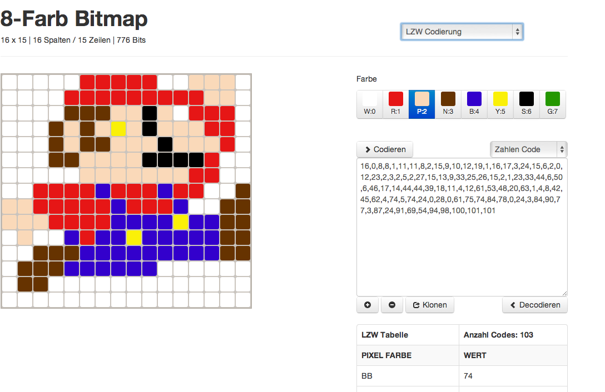
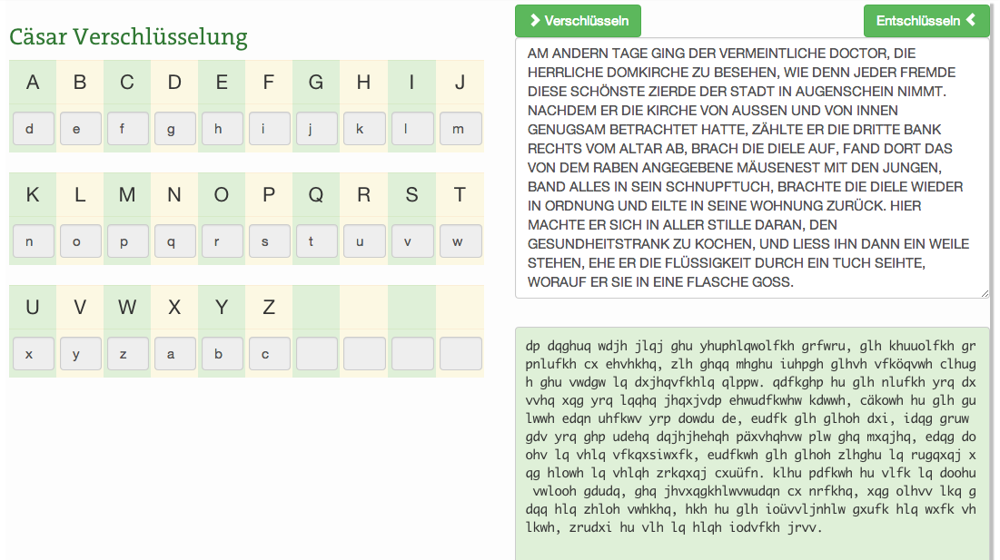
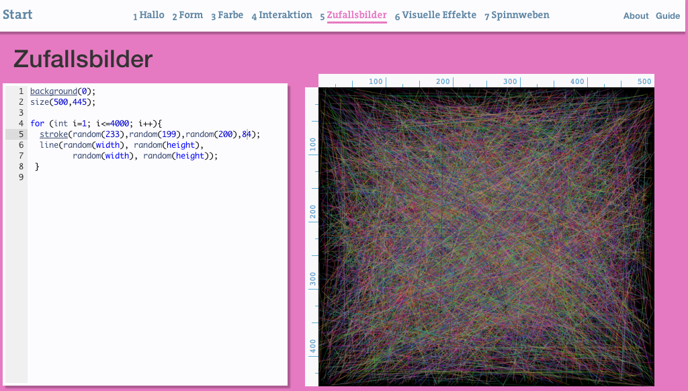
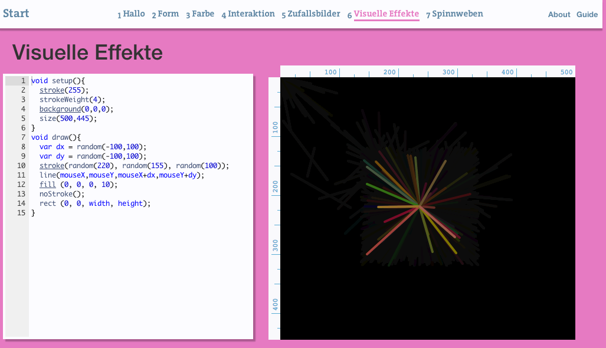
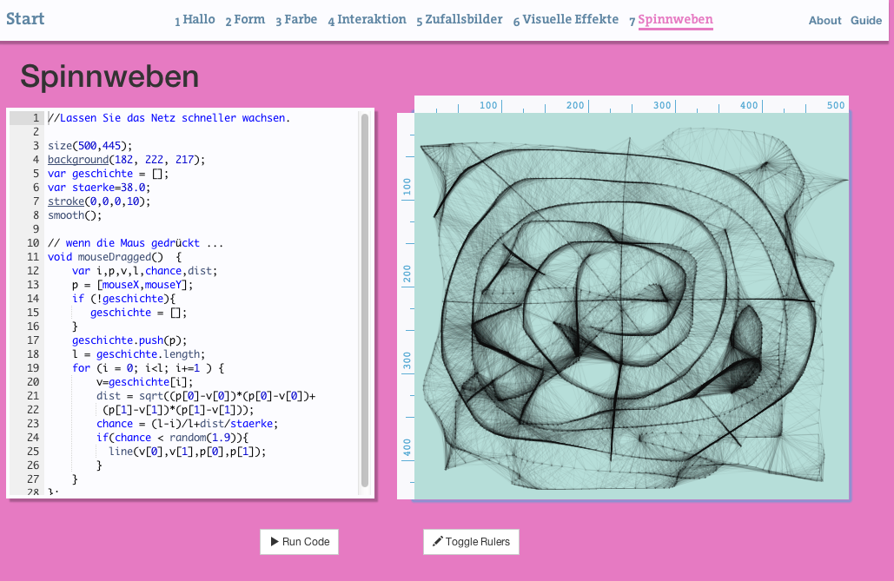
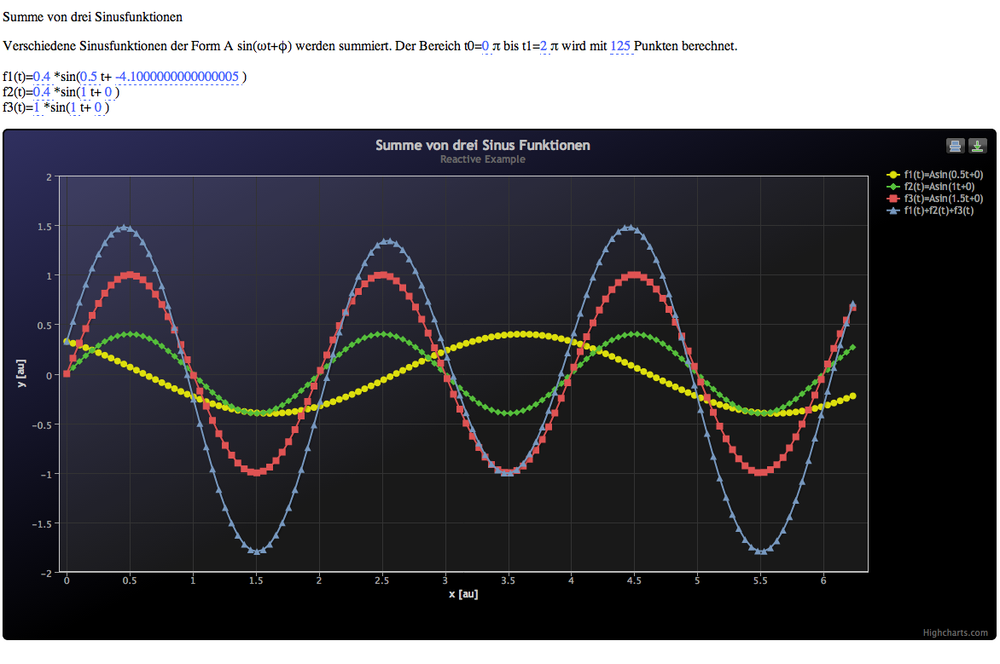
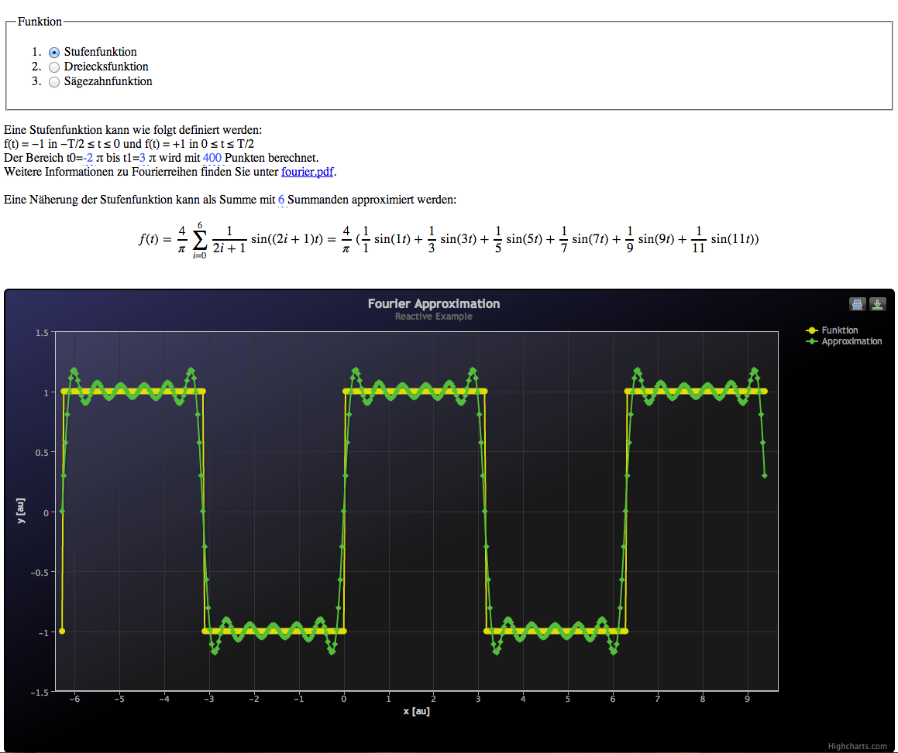

## Frei zugängliche interaktive Experimente

[Lempel-Ziv-Welch (LZW) Codierung](http://mgje.github.io/Codierung/LZW_Mittel.html)

[Cäsar Verschlüsselung](http://mgje.github.io/Crypto/exp1/)

[ROT-X Verschlüsselung](http://mgje.github.io/Crypto/exp3/index.html)

[Monoalphabetische Verschlüsselung](http://mgje.github.io/Crypto/exp4/index.html)

[Verschlüsselte Texte dechiffrieren](http://mgje.github.io/Crypto/exp7/index.html)

[Huffman Codierung](http://mgje.github.io/Codierung/Huffman.html)

[Lauflängen Codierung](http://mgje.github.io/Codierung/Lauflaengen_Mini.html)

[Heuhaufen - Exeperimente mit dem Zufall](http://mgje.github.io/webprogramming/processing/zufallsbilder.html)

[Virtuelles Fuerwerk](http://mgje.github.io/webprogramming/processing/visuelle_effekte.html)

[Spinnweben simulieren](http://mgje.github.io/webprogramming/processing/spinnweben.html)

[Summe von drei Sinusfunktionen](http://mgje.github.io/fourierseries/SinusSumme.html)

[Experimente mit der Fourierreihe](http://mgje.github.io/fourierseries/Fourierreihen.html)

## Internationaler Wettbewerb  «Informatik-Biber» 

Der internationale Wettbewerb «Informatik-Biber» richtet sich an Schülerinnen und Schüler der Grundstufe (dritte bis zwölfte Klasse). Jeweils im November können ganze Schulklassen online während einer Lektion teilnehmen. Im Jahr 2013 wurden fast 10'000 Teilnehmende registriert. Der schweizerische Verein für Informatik in der Ausbildung (SVIA) organisiert die Durchführung des Wettbewerbs in der Schweiz. 
[http://informatik-biber.ch](http://informatik-biber.ch)

